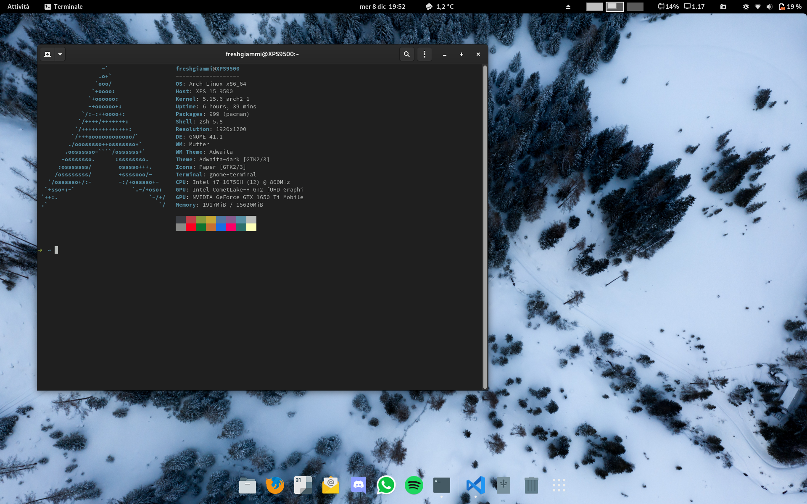

# dotfiles
A collection of my dotfiles.

This is written for [Arch Linux](https://archlinux.org/).  
Files inside `etc` might be different for your usecase, as they're tuned for my install running on a Dell XPS 9500.

## Getting started
To install `dotfiles`, run `./install`.

The installer will guide you through 3 steps: dotfiles (userspace), dotfiles (root), and packages (installed with yay).

This will create symlinks, so that we can edit easily from the repository itself. Any change from the system will be automatically mirrored here due to the nature of symbolic links.

## Credits 

* Dotbot: <https://github.com/anishathalye/dotbot/>
* Dotbot-yay: <https://github.com/oxson/dotbot-yay>
* Dotbot-sudo: <https://github.com/DrDynamic/dotbot-sudo>

## Creator
**Gianmarco Rengucci (freshgiammi)**

* Twitter: <https://twitter.com/freshgiammi>
* Github: <https://github.com/freshgiammi>
* Linkedin: <https://it.linkedin.com/in/gianmarco-rengucci>

## License
The contents of this repository are covered under the [MIT License](LICENSE).